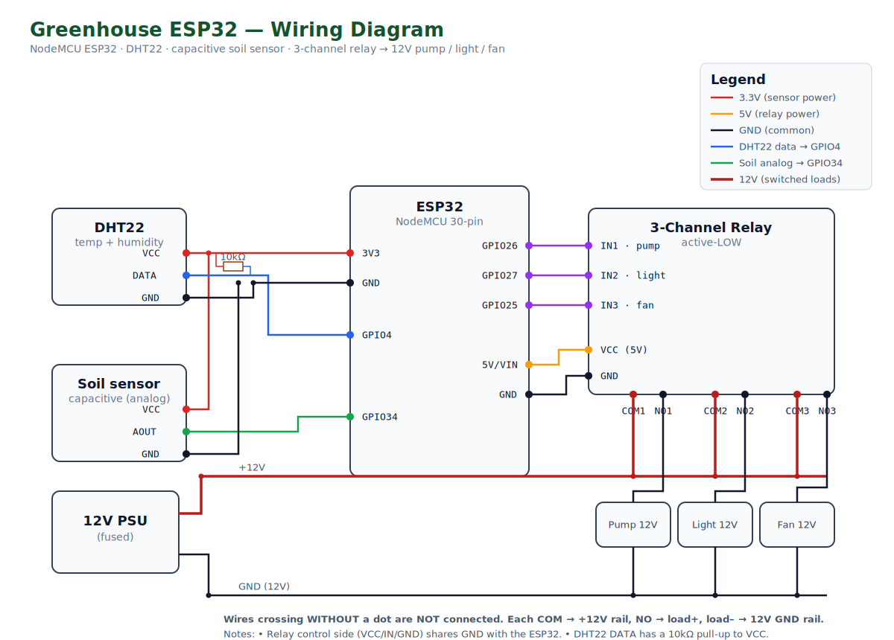

# ESP32 controller — wiring & flashing

Controls the **12 V water pump** (drip irrigation), the **light**, and the **blower fan**
via relays, and reads **temperature/humidity (DHT22)** and **soil moisture**.

## Parts (your kit)
- NodeMCU ESP32 (30-pin, Type-C)
- 3-channel (or 3× 1-channel) relay module
- DHT22 / AM2302 temperature & humidity sensor
- Capacitive soil moisture sensor (analog)
- Diaphragm pump 12 V 4.5 L/min (TY-44520), a light, a fan — all 12 V
- 12 V power supply for the loads + the pump

## Wiring diagram

(Open [`wiring-diagram.svg`](wiring-diagram.svg) for a full-size view.)

| ESP32 pin | Connects to |
| --- | --- |
| GPIO26 | Relay IN1 → **pump** |
| GPIO27 | Relay IN2 → **light** |
| GPIO25 | Relay IN3 → **fan** |
| GPIO4  | DHT22 data (+ 10kΩ pull-up to 3V3) |
| GPIO34 | Soil sensor analog out (input-only pin) |
| 3V3    | DHT22 VCC, soil sensor VCC |
| VIN/5V | Relay module VCC (most boards need 5 V) |
| GND    | Common ground — **ESP32, relays, sensors, and the 12 V supply ground must be tied together** |

**Loads:** wire each 12 V device through its relay's COM/NO contacts on the 12 V supply.
The ESP32 only switches the relay coil; the 12 V never touches the ESP32.

> Relay boards are usually **active-LOW**. The firmware defaults to that
> (`RELAY_ACTIVE_LOW true` in `firmware/src/config.h`). Flip it if your relays are active-high.

### Drip math (already wired into the app)
Your setup delivers ~1 L/plant per 15 min, so the app shows run-time → litres and the
pump's manual/auto run uses minutes. Adjust in the Control screen.

## Flashing

You have two ways to upload. **Option A (Arduino IDE)** is the easiest.

### Option A — Arduino IDE (recommended)
1. Install the **Arduino IDE**, then add ESP32 support:
   *Tools → Board → Boards Manager →* search **esp32** → install **"esp32 by Espressif Systems"**.
2. *Tools → Manage Libraries* → install all three:
   - **PubSubClient** (Nick O'Leary)
   - **ArduinoJson** (Benoit Blanchon, v7)
   - **DHT sensor library** (Adafruit) — also installs **Adafruit Unified Sensor**
3. Open **`firmware/arduino/greenhouse_controller/greenhouse_controller.ino`**.
4. Edit the **CONFIG** block at the top:
   - `WIFI_SSID` / `WIFI_PASSWORD` — your onsite router
   - `MQTT_HOST` — your VPS public IP (or domain)
   - `MQTT_USER` / `MQTT_PASS` — must match the backend env (`MQTT_USERNAME` / `MQTT_PASSWORD`)
   - confirm the GPIO pins match your wiring; calibrate `SOIL_DRY` / `SOIL_WET`
5. *Tools → Board →* **ESP32 Dev Module**, pick the **Port**, click **Upload (→)**.
6. Open *Tools → Serial Monitor* at **115200** baud to watch it connect.

### Option B — PlatformIO
1. Install **VS Code** + the **PlatformIO** extension (or the PlatformIO CLI).
2. Open the `firmware/` folder, edit `firmware/src/config.h` (same settings as above).
3. Connect the ESP32 by USB and **Upload** (or `pio run -t upload`).

> Calibrate the soil sensor: read its raw value in **dry air** → that's `SOIL_DRY`,
> then fully **in water** → that's `SOIL_WET`. The serial monitor prints readings.

When it connects, it appears **Online** on the app's dashboard and Control screen.

## Modes (per device: pump / light / fan)
- **Manual** — you flip it on/off from the app (pump also takes a run duration).
- **Schedule** — runs at the times you set on the Control screen.
- **Auto** — the ESP32 enforces the climate rules **locally**:
  - Fan turns on above your temperature/humidity thresholds.
  - Pump runs when soil moisture drops below your threshold (with a max run-time cap).
  Auto keeps working even if the internet or VPS goes down.

## Remote updates (OTA) — no cable after the first flash

The firmware (v1.1+) supports **over-the-air updates** and **self-healing**:

- **Self-healing:** it auto-reconnects WiFi/MQTT, and if it can't get back online
  within ~5 minutes it **reboots itself** to recover. A WiFi blip no longer leaves
  it stuck offline.
- **OTA:** once v1.1 is flashed via USB *one time*, all future updates go over the
  internet — no cable, no buttons.

### How to push an update remotely
1. In Arduino IDE, edit the sketch, then **Sketch → Export Compiled Binary**.
   This creates a `.bin` in the sketch folder (use `…ino.bin`, *not* the
   `.bootloader.bin` or `.partitions.bin`).
2. In the **app → Settings → Firmware update (OTA)** → **Choose firmware .bin** →
   pick that file.
3. The app uploads it to your VPS; the VPS tells the ESP32 to download and flash it.
   The board reboots into the new firmware in ~30 seconds.
   - If the board is **offline** when you upload, it'll grab the update the next time
     it connects.

> First time only: flash **v1.1 over USB** to get OTA onto the chip. After that,
> step 1–3 above is all you ever need.

### Tip: a smart plug for emergencies
Since the board is remote, a cheap **WiFi smart plug** on the ESP32's USB power lets
you hard power-cycle it from anywhere if it ever truly locks up (rare with self-heal).

## Safety
- The firmware caps any single pump run at 30 min (`PUMP_MAX_RUN_MS`) as a flood guard.
- Use a fused 12 V supply rated above the combined load of pump + fan + light.
